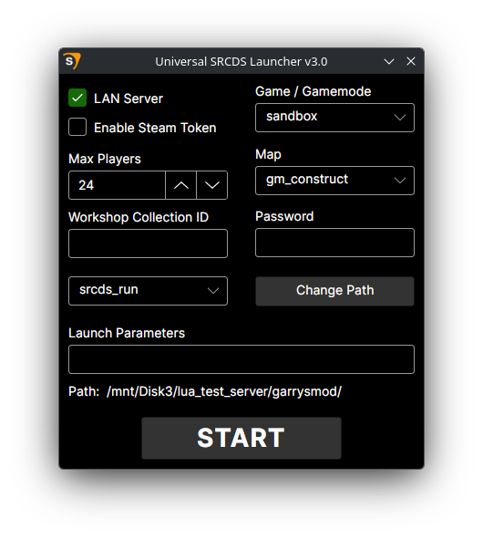

# Universal SRCDS Launcher
 This is designed to replace the default launcher for GoldSrc, Source, or Source 2 dedicated servers. The launcher supports Windows 10/11 and most Linux distros. No additional dependencies are required for either platform. If you're looking for the older version based on WinForms and .NET Framework 4.8, [click here](https://github.com/LambdaGaming/Universal-Srcds-Launcher/releases/tag/v2.4).

# Features
- Map selection (`+map`)
  - Gets the names of maps inside the server's map folder. The map name can also be manually entered into the text box if the map is in a different location.
- Game/Gamemode selection (`+gamemode` or `-game`)
  - For Garry's Mod servers, the launcher will automatically update the list of gamemodes found in the server's gamemodes folder
  - For s&box servers, the box will be filled with a placeholder gamemode that can be manually changed
  - For all other games, it will use the name of the selected game folder
- LAN mode toggle (`+sv_lan`)
- Max players slider (`+maxplayers`)
- Password option (`+sv_password`)
- Steam token input (`+sv_setsteamaccount`)
  - Certain games including Garry's Mod and CS:GO require the server to be registered with Steam in this way for it to show up in the server browser
- Steam workshop collection option (`+host_workshop_collection`)
- Executable selection
  - Allows you to choose from a list of valid server executables
- Input for additional launch parameters
- Full Linux support
  - The launcher will automatically scan for installed terminals and launch the server through one of them. Only a handful of terminals are currently supported, so if you want to use one that's unsupported please let me know.
- All settings are saved when the launcher closes and will be automatically restored when the launcher is opened again.

# Notes
- If you need the launcher to run more than one server, you can create a shortcut to the launcher and pass any name as a launch parameter to generate a new config under that name. Configs are saved in `~/.local/share/Universal-Srcds-Launcher` on Linux, and `%localappdata%\Universal-Srcds-Launcher` on Windows.
- If you get a permission denied error when trying to start a server on Linux, make sure the srcds_run file(s) have execute permissions.

# Building
 All you need is the .NET 10 SDK, then you can run `publish_linux.sh` or `publish_windows.bat` depending on your OS. VSCode with the C# Dev Tools extension is recommended but not required.

# Contributing
 Contributions are welcome! Please read through the [guidelines](https://lambdagaming.github.io/guides/contributing) before submitting an issue or pull request.
